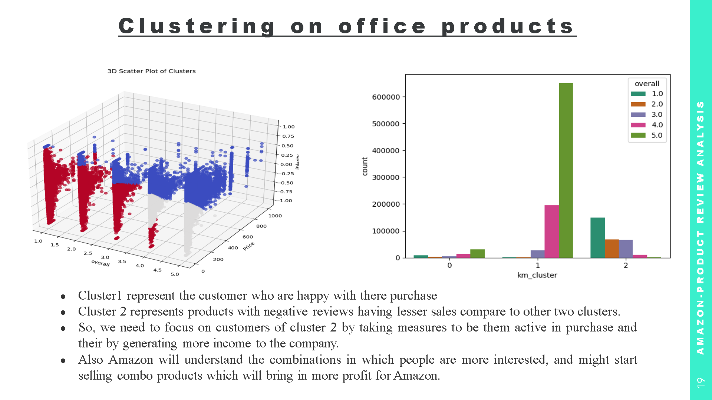

  # Amazon review project 

In this project, we are using Amazon review data to:

* Examine the emotions and opinions expressed by customers
* Discover strategies to retain and satisfy existing customers
* Anticipate what future reviews must hold
* Project how customer sentiment may evolve in the coming years
* Group customers based on their preferences and feedback

## Data
  we are using the Stanford data for this project
  [Link_to data](https://cseweb.ucsd.edu/~jmcauley/datasets/amazon/links.html)

  

## Analysis of the Cleaned data
[Link_to data_cleaning_notebook](https://github.com/Hirann97/Amazon_product_review_Analysis/blob/main/amazon%20project%20%20Data%20preprocessing%20and%20sentiment%20analysis.ipynb)

### Fake Reviews?
Fake reviews on Amazon can:

- Mislead customers.
- Create unfair competition.
- Damage Amazon's reputation.
- Reduce consumer confidence.
- Pose legal risks.

[Link_to csv of fake reviews](https://github.com/Hirann97/Amazon_product_review_Analysis/tree/main/findings)

## Creating a Classification Model.

-we've developed three distinct models leveraging Multinomial Naïve Bayes, Logistic Regression, and Linear Support Vector Classification (SVC) techniques.
-We harnessed the power of TF-IDF (Term Frequency-Inverse Document Frequency) for text vectorization.
-The bellow table shows how these models performed;

- The hyper-tuned Linear SVC model had the best results compared to all the others.

- MultinomialNB model takes less time for prediction.

- Hyper-tuned Linear SVC model takes less time than  Logistic

- As Hyper-tuned Linear SVC  is the best model, selecting that as the final model

## An API for sentiment Analysis

  

[Link_to API](https://github.com/Hirann97/Amazon_product_review_Analysis/tree/main/api_for_sentiment_analysis)

-

-

# Dashboard Created using tableau.
-

  

  

