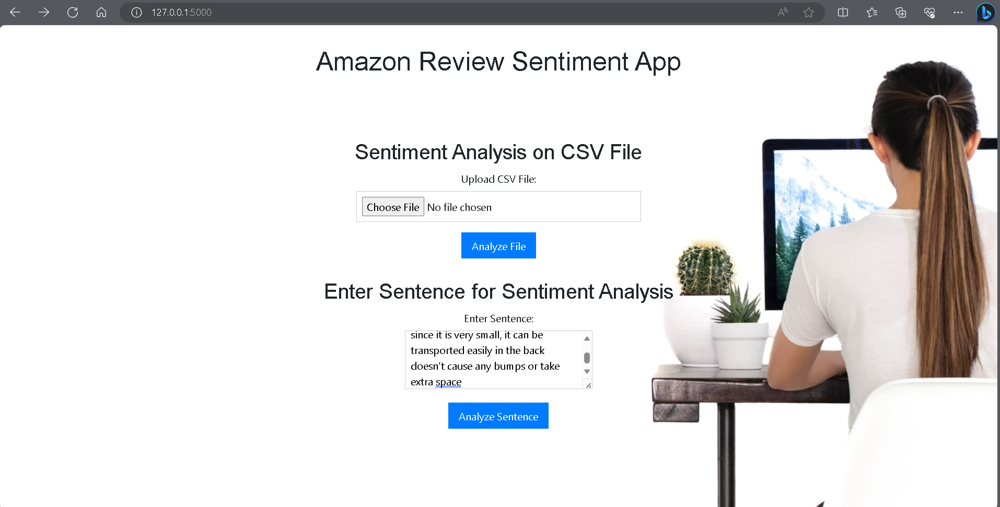

# Home Page of API
We can do 2 functions on the home page;
  - We can paste a review in the 'Enter sentence column'.
  - We can add a CSV file with reviews to find the overall sentiment of the file.

## Result 1
 - This is for the singular review

-
-
## Result_2
 - This is for the CSV files

   
   
    
